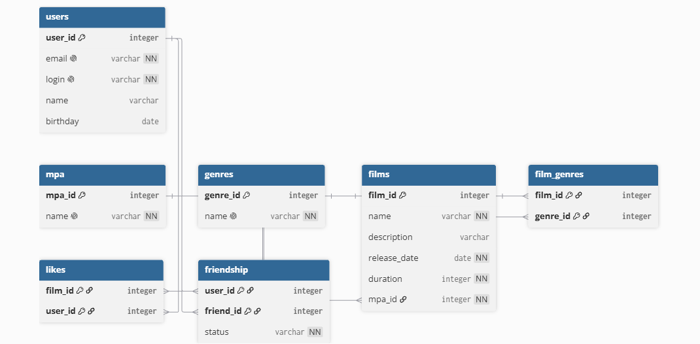

# java-filmorate
Template repository for Filmorate project.
## Схема базы данных



### Основные таблицы
- **users** — пользователи приложения.
- **films** — фильмы, каждый ссылается на свой возрастной рейтинг через `mpa_id`.
- **mpa** — справочник рейтингов MPA (G, PG, PG-13, R, NC-17).
- **genres** — справочник жанров.
- **film_genres** — связь «многие ко многим» между фильмами и жанрами.
- **likes** — связь «многие ко многим» между пользователями и фильмами (лайки).
- **friendship** — направленная связь дружбы между пользователями со статусом
  (`UNCONFIRMED` — заявка отправлена, `CONFIRMED` — дружба подтверждена).

### Примеры запросов

**Получить все фильмы с названием рейтинга:**
```sql
SELECT f.film_id, f.name, f.description, f.release_date, f.duration, m.name AS mpa_name
FROM films f
JOIN mpa m ON f.mpa_id = m.mpa_id;
```

**Получить жанры конкретного фильма:**
```sql
SELECT g.name
FROM film_genres fg
JOIN genres g ON fg.genre_id = g.genre_id
WHERE fg.film_id = ?;
```

**Топ-N популярных фильмов по числу лайков:**
```sql
SELECT f.film_id, f.name, COUNT(l.user_id) AS likes_count
FROM films f
LEFT JOIN likes l ON f.film_id = l.film_id
GROUP BY f.film_id, f.name
ORDER BY likes_count DESC
LIMIT ?;
```

**Список друзей пользователя:**
```sql
SELECT u.*
FROM friendship fr
JOIN users u ON u.user_id = fr.friend_id
WHERE fr.user_id = ?;
```

**Общие друзья двух пользователей:**
```sql
SELECT u.*
FROM friendship fr1
JOIN friendship fr2 ON fr1.friend_id = fr2.friend_id
JOIN users u ON u.user_id = fr1.friend_id
WHERE fr1.user_id = ? AND fr2.user_id = ?;
```

**Подтверждение заявки в друзья** (когда получатель тоже добавляет отправителя):
```sql
UPDATE friendship
SET status = 'CONFIRMED'
WHERE user_id = ? AND friend_id = ?;
```